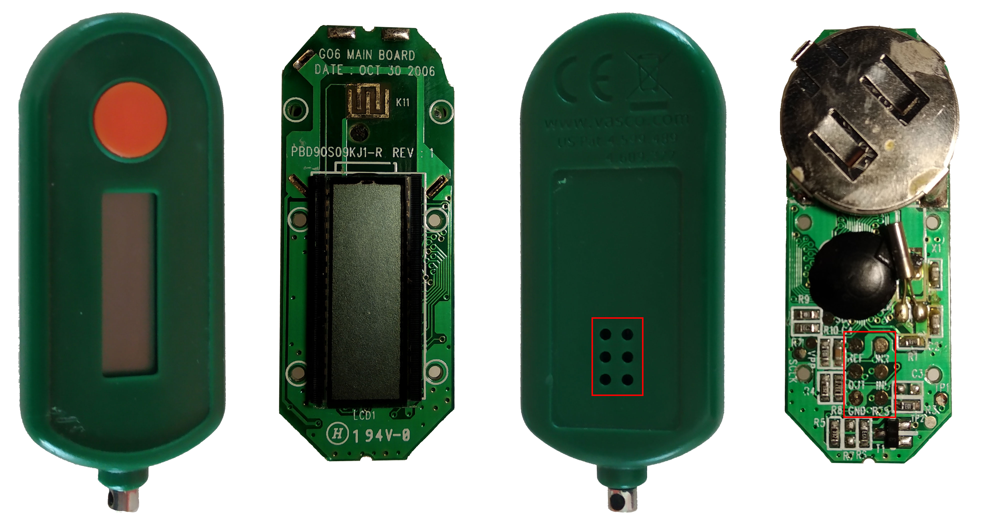
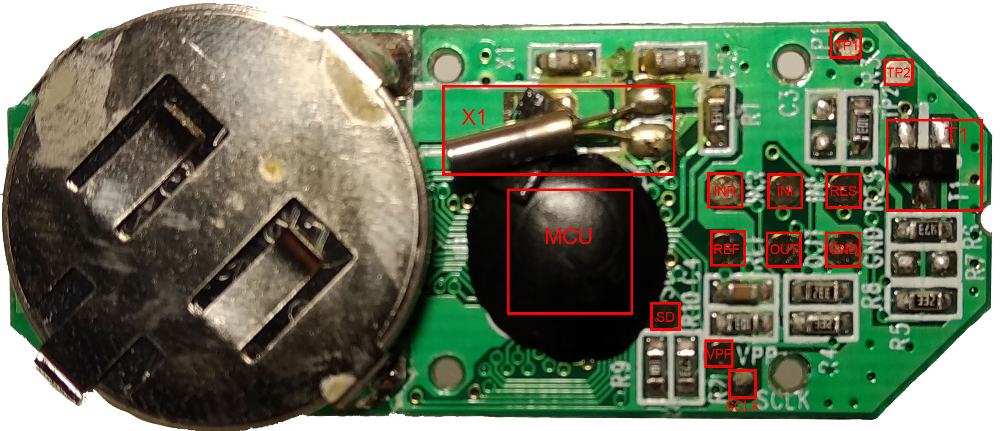
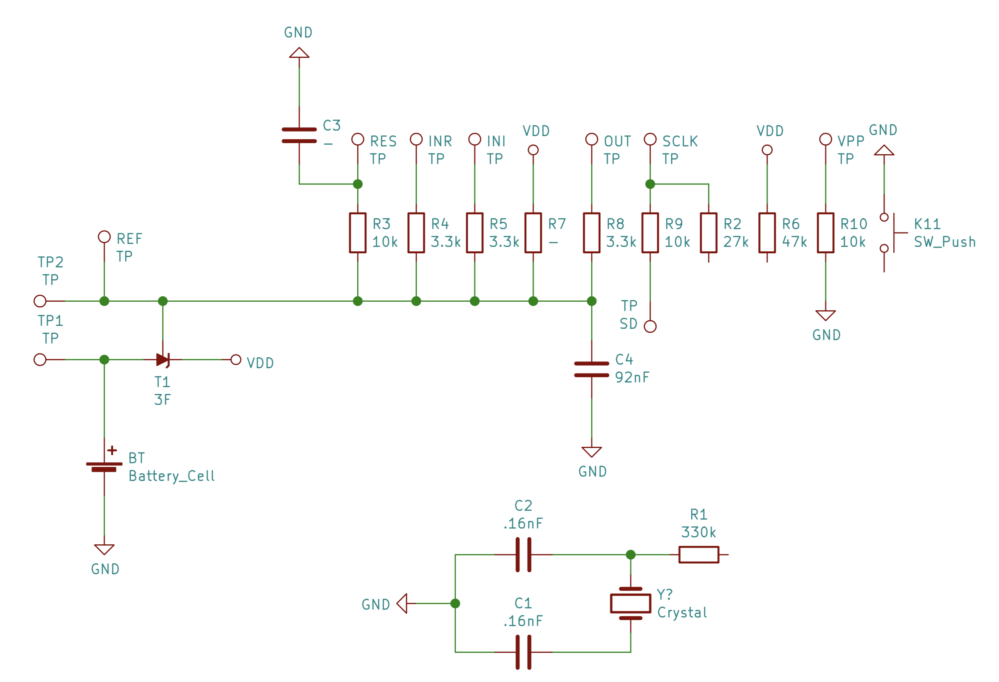

# DIGIPASS GO 6

Recently I retriever some bank security token (dismissed in favour of authentication using the smartphone app) and i would to analyze them.

Over the plastic shell is reported the site  of manufacturer, so after some click I found that this tokens are [Vasco DIGIPASS GO 6](https://www.vasco.com/products/two-factor-authenticators/hardware/one-button/digipass-go-6.html) (also used by *Blizzard*).

After removing the two labels I not found screws, so I used the hard way and after some time I discovered the board:

In this picture are visible **6 drill** in the plastic shell in correspondence of 6 test points over the board. This probably was made in order to allow to flash the firmware after closing the shell (tipically this can be an ICSP interface).

In [this video](https://www.youtube.com/watch?v=c1FqmqPsM0g) seems that the *DIGIPASS GO 3* mount the same board.

After some more analysis I found **11 test poits**:

Over the board is also visible a **chip-on-board MCU** (COB make hard to discover the model), a **crystal oscillator** (X1), some **resistors** and some **capacitors**.
The T1 elemet seems to be an **transistor**.

Using my multimeter for inspection I have draw a partial schematic:

### Links
  - [DIGIPASS GO 6 Shell open video](https://www.youtube.com/watch?v=oktBQXH7NhI)
  - [DIGIPASS GO 3 rev 0E](https://xiaolabadiy.tumblr.com/page/29)
  - [DIGIPASS GO replicate](https://www.youtube.com/watch?v=NqtPt3L80mo)
  - [App Token Reverse](https://blog.valverde.me/2014/01/03/reverse-engineering-my-bank's-security-token/#.XKdM4OszZTZ)